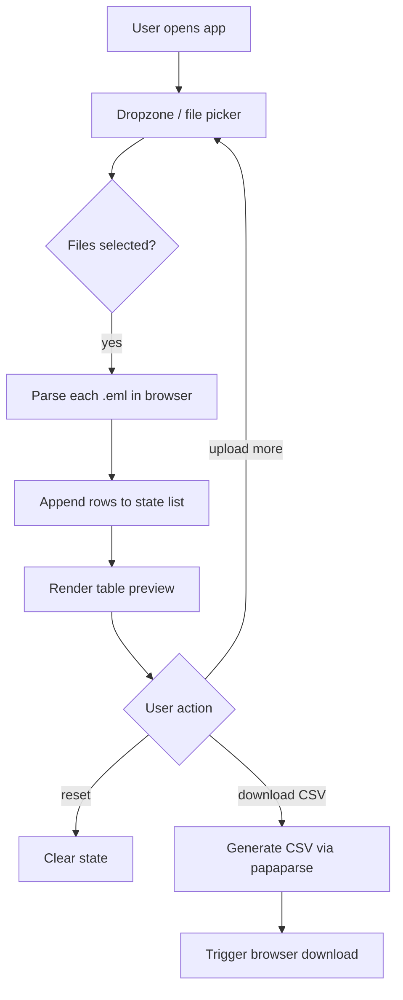

# Plan: EML to CSV Web App (React)

## Overview
A client-side React web application that lets users upload multiple `.eml` files (click or drag-and-drop), parses them entirely in the browser, displays the extracted data in a list/table, supports appending more uploads, resetting, and downloading the result as a CSV file.

All parsing happens **client-side** — no backend, no file uploads to a server. This keeps it private and simple to deploy (static hosting).

---

## Tech Stack

| Concern | Choice | Reason |
|---------|--------|--------|
| Framework | **Vite + React** (TypeScript) | Fast dev server, minimal config, modern |
| EML parsing | [`mailparser`](https://nodemailer.com/extras/mailparser/) (browserified) **or** [`eml-parser`](https://www.npmjs.com/package/eml-parser) / [`postal-mime`](https://www.npmjs.com/package/postal-mime) | Robust MIME/quoted-printable/base64 handling |
| Drag & drop | Native HTML5 drag events (no extra dep) | Keep bundle small |
| CSV generation | [`papaparse`](https://www.papaparse.com/) | Handles escaping/quotes/newlines correctly |
| Styling | **Tailwind CSS** | utility-first, fast to style |
| Persistence | **localStorage** | list survives page refresh |
| State | React `useState` / `useReducer` | App is small, no Redux needed |

> **Recommended parser: `postal-mime`** — it is purpose-built for browsers, lightweight, and handles attachments, HTML/text bodies, and encoded headers out of the box.

---

## Extracted CSV Columns

| Column | Source header / field | Notes |
|--------|----------------------|-------|
| `filename` | uploaded file name | e.g. `Selamat datang di Dicoding.eml` |
| `title` (Subject) | `Subject` header | Decoded (RFC 2047) |
| `description` | first 255 chars of plain-text body | Stripped of HTML if only HTML part exists |
| `sender` | `From` header | Name + email |
| `receiver` | `To` header | May be multiple, joined with `; ` |
| `date` | `Date` header | ISO/normalized |
| `attachments` | attachment names + size | e.g. `ticket.pdf (120KB); photo.jpg (45KB)` or `none` |
| `cc` | `Cc` header (optional) | if present |
| `message_id` | `Message-ID` header | useful for dedup |

---

## App Flow



---

## Component Structure

```
src/
  App.tsx                  # root, holds global state, layout
  components/
    Dropzone.tsx           # drag-and-drop + click-to-select, accepts .eml
    EmailTable.tsx         # preview table of parsed rows
    Toolbar.tsx            # Download CSV + Reset buttons + row count
    StatBar.tsx            # optional: counts (total, with attachments, etc.)
  lib/
    parseEml.ts            # wrapper around postal-mime -> normalized row
    csvExport.ts           # build + download CSV using papaparse
    types.ts               # EmailRow interface
  styles/
    app.css
```

### Key data type

```ts
interface EmailRow {
  filename: string;
  subject: string;          // title
  description: string;      // body snippet, max 255 chars
  sender: string;
  receiver: string;
  date: string;
  attachments: string;      // formatted string for CSV cell
  cc: string;
  messageId: string;
}
```

---

## Implementation Steps

1. **Scaffold project** — `npm create vite@latest . -- --template react-ts`, install deps: `postal-mime`, `papaparse`.
2. **`lib/types.ts`** — define `EmailRow` interface.
3. **`lib/parseEml.ts`** — async function `parseEmlFile(file: File): Promise<EmailRow>`:
   - `await file.text()` → `PostalMime.parse()`
   - map fields, truncate body to 255 chars, format attachments list.
4. **`lib/csvExport.ts`** — `downloadCsv(rows: EmailRow[])` using `Papa.unparse`.
5. **`components/Dropzone.tsx`** — handle `onDrop`, `onDragOver`, hidden `<input type="file" multiple accept=".eml">`.
6. **`components/EmailTable.tsx`** — render rows; show empty-state message when no data.
7. **`components/Toolbar.tsx`** — Download (disabled when empty) + Reset (with confirm).
8. **`App.tsx`** — wire state (`EmailRow[]`), append on new upload (dedupe by `messageId`/filename), reset clears array.
9. **Styling (Tailwind)** — responsive table, drag highlight, basic polish.
10. **localStorage persistence** — save/load `EmailRow[]` so the list survives refresh.
11. **Test** with the real `eml/260620` and `eml/260630` folders (drag the whole folder).
12. **Build** — `npm run build` → static `dist/` ready to host anywhere.

---

## Edge Cases to Handle

- **Duplicate uploads** — dedupe by `messageId` (fallback to filename) so re-adding the same file doesn't double rows.
- **Encoding** — RFC 2047 encoded subjects (e.g. emoji, `=?UTF-8?...?=`) — `postal-mime` decodes these.
- **HTML-only emails** — strip tags to get plain text snippet (use a small regex or `DOMParser`).
- **Very large files** (e.g. 584KB dormant email) — parse asynchronously, show a loading spinner; avoid blocking UI.
- **Attachments** — capture name + size only (per requirement), do not download/extract binary content into CSV.
- **Missing fields** — default to empty string / `none`.
- **CSV escaping** — papaparse handles commas, quotes, newlines inside cells.

---

## Non-Goals (out of scope)
- No backend / server storage.
- No email sending.
- No authentication.
- No persistent storage (refresh = reset); optional: `localStorage` persistence could be added later.

---

## Open Questions for User

1. **Styling preference**: plain CSS, Tailwind, or a component library (MUI/Chakra)?
2. **Persistence**: should the list survive a page refresh (localStorage), or reset on reload is fine?
3. **Additional columns**: any other fields you want (e.g. body length, has-attachment flag as separate column)?
